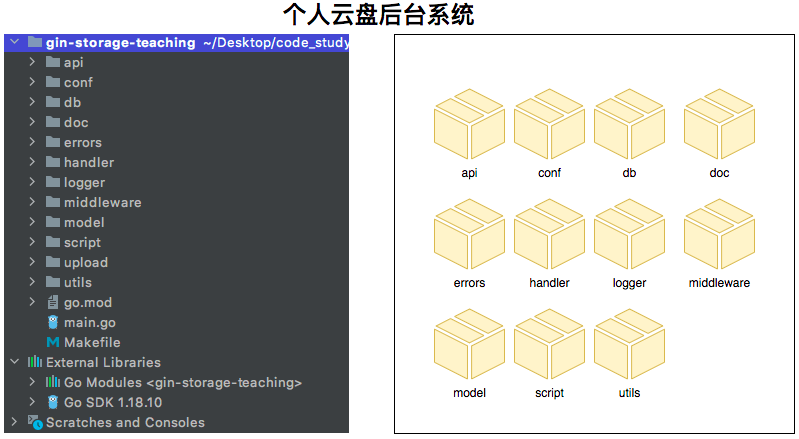

# 包


在 `Go` 中，一个包（`Package`）是一组相关的代码文件的集合，编写代码时我们通常将相同模块的代码划分到一个`Package`中以便于重用和维护。每个 `Go` 程序都至少包含一个包，即 `main` 包，其中的 `main` 函数作为程序的入口点。我们首先来看第一个示例。

## 目录

- 入门
- 导入标准库
- 导出函数与属性
- 包别名和匿名包

## 入门 

在`golang`中每个独立运行的 `Go` 程序都至少包含三部分`package main`, `import`, `func main()`

```go
package main // 定义了包名,只有定义了main的包才能独立运行

// 导入: 标准库和第三方库
import (
	"fmt" // 引入一个标准库包
)

// main 函数,程序的入口
func main() {
	// 调用标准库 fmt 在控制台打印 hello world 字符串
	fmt.Println("hello world")
}

// 通过命令行运行
// go run main.go
// go build main.go && ./main
```

如上代码中`package main`表示当前代码属于`main`包, `main`包是一个特殊的包，我们的启动函数`func main()`**必须**要定义在`package main`下才能执行。

`import()`表示要**导入标准库(**也可以叫做导入一个包)或**第三方包**, 在实际开发中会引入许多标准库和第三方包来简化业务开发。这里我们导入一个`fmt`的标准库，这个标准库定义了一些函数在控制台输出一些信息，如`Println()`函数。

`func main()`函数是程序入口。我们可以通过这个函数来运行我们编写的代码，我们在`func main()`函数中调用`fmt`标准库的`Println()`函数在控制台打印一个字串`hello world`并换行。

## 导入标准库

上一个`Demo`简单介绍了`import()`, 这一节我们详细介绍`import()`。`import()`函数用来导入标准库和第三方库，只有通过`import()`导入的标准库和第三方库我们才能在当前`package`下调用**并且只能调用引入`package`下已经导出的函数, 变量, 常量等。**

```go
package main

// 导入: 标准库和第三方库
import (
	"fmt"
	"math/rand" // 导入rand库
)

// main 函数,程序的入口。
func main() {
	// 调用标准库 fmt 在控制台打印 hello world 字符串
	// rand.Intn(10) 函数返回一个取值范围在[0,n)的伪随机int值，如果n<=0会panic。
	fmt.Println("hello world", rand.Intn(10))
}
```

其中 `math/rand` 是要导入的包的名称。一旦导入，就可以使用该包中**导出**的函数、变量和其他标识符，其中在`func main()`函数中调用标准库(`math/rand`)的`rand.Intn(n)`函数获取一个`[0,n)`的伪随机`int`值。

## 导出函数、变量、常量

在`golang`语言中想调用**其它包**的函数、变量、常量**需要被调用函数、变量、常量是导出的（在同一包下不导出也可以使用）**, 导出一个函数、变量、常量非常简单, **只需首字母大写就代表该函数或变量导出**。这是`Go`语言的一种访问控制机制，用于公开希望外部使用的函数、变量、常量等。

`math`包如下(省略一些信息和注释方便查看)

```go
package math

.........

// Integer limit values.
const (
	intSize = 32 << (^uint(0) >> 63) // 32 or 64 // 未导出, 其余package不能调用

	MaxInt    = 1<<(intSize-1) - 1 // 导出, 其余package能调用
	MinInt    = -1 << (intSize - 1)
  
  .........
)
```

由于 `MaxInt` 和 `MinInt` 的名称以大写字母开头，因此它们可以被导出到 `math` 的外部使用。如果您在另一个包中导入了 `math`，则可以使用以下代码访问`MaxInt` 

```go
package main

// 导入: 标准库和第三方库
import (
	"fmt"
	"math"
)

// main 函数,程序的入口。
func main() {
	// 注意：在导入一个包时，你只能引用其中已导出的名字。任何“未导出”的名字在该包外均无法访问

	// 什么是导出？首字母大写代表导出,小写代表不导出
	//fmt.Println("intSize",math.intSize) // 引用未导出变量将报错
	fmt.Println("MaxInt", math.MaxInt) // 引用导出的变量
}
```

另一方面, 由于`intSize`的名称以小写字母开头，因此它们只能在`math`中使用。如果您在另一个包中导入了 `math`，则不能访问这个常量。

## 包别名和匿名包

在 Go 语言中，可以为已经导入的包指定一个新的名称，这个新的名称可以在当前的代码中代替原本的包名。

```go
package main

// 导入: 标准库和第三方库
import (
	"fmt"
	m "math"      // 给math包起一个别名 m
	_ "math/rand" // 匿名包，主要用于引入一些驱动的init函数的初始化
)

// main 函数,程序的入口。
func main() {
	fmt.Println("MaxInt", m.MaxInt) // 引用导出变量的时候也要用别名
}
```

在上面的代码中，我们为包 `math` 指定了别名 `m`。这样，在当前的代码中，我们就可以使用 `m` 来代替原本的包名。使用包别名可以解决一些包名冲突的问题，或者让代码更加简洁易读。但是，过度使用包别名也可能会让代码更加难以理解和维护，所以需要适度使用。此外，还通过`_ "math/rand"`的方式引入 `math/rand` 包，这样的包称为匿名包。导入匿名包的作用：

- 初始化: 匿名包的主要作用是**执行它的 `init()` 函数**(函数章节讲解)，比如在导入一些数据库驱动或者其他库的时候需要做一些初始化的操作。

- 副作用: 匿名包可以执行包中的一些副作用操作，比如**自动注册模块**，或者是**对全局变量进行初始化**等。

**简单来说匿名包就是用于加载执行其他包的初始化操作。**

## 包管理具体示例



## 思考题

1. 导入`math`包, 通过`Sqrt`函数求 9 的平方根并打印

## 自检

- `package`的作用？
- `main`包的特殊性质？
- `import`语句？
- 包的导出与非导出成员？
- 包的初始化顺序?
- 包别名？
- 包级别的变量和函数？
- `init`函数？

## 参考

https://go.dev/doc/modules/managing-source

https://www.modb.pro/db/150484

https://calvertyang.github.io/2019/11/12/a-beginners-guide-to-packages-in-golang/

https://golangdocs.com/packages-in-golang