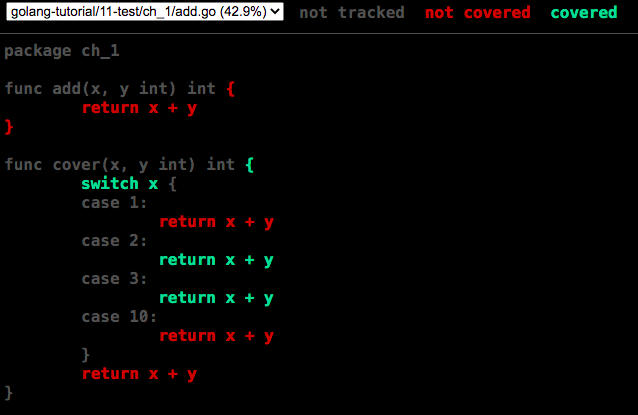

# Test

在 `Go` 语言中，可以使用内置的测试框架来进行单元测试, 基准测试。帮助开发者编写、运行和管理测试代码，确保代码的质量和稳定性。

## 目录

- 单元测试
  - 简单测试
  - 子测试
  - 表驱动测试
  - 测试覆盖率
- 基准测试

## 单元测试

### 简单测试

 `Go`语言中编写一个测试的基本步骤：

1. 创建测试文件：测试文件应该与被测试的代码放在同一个包中，并以 `_test.go` 结尾。例如，要测试名为 `add` 文件中的函数，可以创建一个名为 `add_test.go` 的文件。
2. 编写测试函数：测试函数应该以 `Test` 开头，后跟被测试函数的名称。例如，要测试名为 `add` 的函数，可以创建一个名为 `TestAdd` 的测试函数。
3. 编写测试代码：测试函数应该包含测试代码，以验证被测试函数的行为是否符合预期。测试代码应该使用 `t.Error` 或 `t.Fail` 等函数来报告测试失败结果。
4. 运行测试：在命令行中使用 `go test` 命令来运行测试。如果测试通过，将输出 `PASS`。如果测试失败，将输出失败的测试用例的详细信息。

示例代码：

```bash
# 目录
ch_1
|-- add.go
|-- add_test.go
```

```go
// add.go
package ch_1

func add(x, y int) int {
	return x + y
}
```

```go
// add_test.go
package ch_1

import "testing"

// go test
func TestAdd(t *testing.T) {
	result := add(2, 3)
	expected := 5
	if result != expected {
		t.Errorf("add(2, 3) returned %d, expected %d", result, expected)
	}
}
```

这个示例测试了 `Add` 函数是否能正确地计算两个整数的和。

```go
go test 
```

默认情况下, `go test` 命令会运行当前包中的所有测试, 并输出测试结果。如果测试成功，则输出 `PASS`；如果测试失败，则输出 `FAIL`。如果测试运行期间出现 `Panic`，测试会被中止并输出相关信息。

```bash
$  go test 
PASS
ok      golang-tutorial/11-test/ch_1    0.017s
```

`go test` 命令还包含一些常用命令选项：

- `-v`：输出测试详情；
- `-run`：指定要运行的测试函数，可以通过正则匹配；

例如

```bash
# 测试当前目录下所有单元测试并输出测试详情
go test -v . 

# 测试当前目录下后缀名称为Add的单元测试并输出测试详情
go test -run="Add$" -v 
```

执行`go test -run="Add$" -v`后得到结果

```bash
$ go test -run="Add$" -v
=== RUN   TestAdd
--- PASS: TestAdd (0.00s)
PASS
ok      golang-tutorial/11-test/ch_1    0.009s
```

- === RUN 表示运行的测试函数
- --- PASS 表示测试函数的结果为通过

### 子测试

除了基本的测试外，`Go` 语言测试框架还提供了一些高级功能，以帮助更好地组织和管理测试代码。

其中**子测试**, 可以在一个测试函数中创建多个子测试，每个子测试都可以独立运行和失败, 使用 `t.Run` 函数来创建子测试。

```go
func TestAdd(t *testing.T) {
  // 子测试一
	t.Run("test case 1", func(t *testing.T) {
		result := add(2, 3)
		expected := 5
		if result != expected {
			t.Errorf("add(2, 3) returned %d, expected %d", result, expected)
		}
	})

  // 子测试二
	t.Run("test case 2", func(t *testing.T) {
		result := add(3, 3)
		expected := 6
		if result != expected {
			t.Errorf("add(3, 3) returned %d, expected %d", result, expected)
		}
	})
  	
  // 子测试三
	t.Run("test case 3", func(t *testing.T) {
		result := add(4, 4)
		expected := 7
		if result != expected {
			t.Errorf("add(4, 4) returned %d, expected %d", result, expected)
		}
	})
}
```

如上就是子测试的相关代码，他可以分别运行每个`t.Run`,也可以通过`go test -run="TestAdd"`全部运行, 结果如下：

```bash
$ go test -run="TestAdd$" -v
=== RUN   TestAdd
=== RUN   TestAdd/test_case_1
=== RUN   TestAdd/test_case_2
=== RUN   TestAdd/test_case_3
		add_test.go:35: add(3, 3) returned 8, expected 7 # 失败日志
--- FAIL: TestAdd (0.00s)
    --- PASS: TestAdd/test_case_1 (0.00s) # 子测试 1 通过
    --- PASS: TestAdd/test_case_2 (0.00s) # 子测试 2 通过
    --- FAIL: TestAdd/test_case_3 (0.00s) # 子测试 3 失败
FAIL
exit status 1
FAIL    golang-tutorial/11-test/ch_1    0.011s
```

### 表驱动测试

`Go`中还可以使用**表格驱动**测试来测试多组输入和输出。创建一个包含输入和预期输出的表格，然后使用 `for` 循环遍历表格中的每一行并运行测试。

```go
func TestAdd(t *testing.T) {
	type args struct {
		a int
		b int
	}
  
  tests := []struct { // 表格 包含(测试名称，参数，期望值)
		name string
		args args
		want int
	}{
		{
			"1+2",
			args{
				a: 1,
				b: 2,
			},
			3,
		},
		{
			"10+10",
			args{
				a: 10,
				b: 10,
			},
			20,
		},
    {
			"15+15",
			args{
				a: 15,
				b: 15,
			},
			31,
		},
	}
	for _, tt := range tests { // 循环tests表格
		t.Run(tt.name, func(t *testing.T) { // 通过子测试运行
			if got := add(tt.args.a, tt.args.b); got != tt.want {
				t.Errorf("add() = %v, want %v", got, tt.want)
			}
		})
	}
}
```

如上代码`tests`是一个结构体数组,存储测试用的参数和预期结果。通过 `for` 循环遍历数组中的每一行并运行测试。测试结果如下：

```bash
$ go test -run="TestAdd" -v
=== RUN   TestAdd
=== RUN   TestAdd/1+2
=== RUN   TestAdd/10+10
=== RUN   TestAdd/15+15
    add_test.go:81: add() = 30, want 31 # 失败日志
--- FAIL: TestAdd (0.00s)
    --- PASS: TestAdd/1+2 (0.00s) 			# 子测试 1 通过
    --- PASS: TestAdd/10+10 (0.00s)			# 子测试 2 通过
    --- FAIL: TestAdd/15+15 (0.00s)			# 子测试 3 失败
FAIL
exit status 1
FAIL    golang-tutorial/11-test/ch_1    0.015s
```

### 测试覆盖率

`Golang` 工具链提供了内置的覆盖率分析工具。可以通过 `go test -cover` 命令来生成测试覆盖率报告。在报告中，可以看到每个包、每个文件和每个函数的覆盖率信息。

```go
func cover(x, y int) int {
	switch x {
	case 1:
		return x + y
	case 2:
		return x + y
	case 3:
		return x + y
	case 10:
		return x + y
	}
	return x + y
}

func TestCover(t *testing.T) {
	t.Run("test case 1", func(t *testing.T) {
		result := cover(2, 3)
		expected := 5
		if result != expected {
			t.Errorf("add(2, 3) returned %d, expected %d", result, expected)
		}
	})

	t.Run("test case 2", func(t *testing.T) {
		result := cover(3, 3)
		expected := 6
		if result != expected {
			t.Errorf("add(3, 3) returned %d, expected %d", result, expected)
		}
	})
}
```

执行并分析

```go
$ go test -run="Cover$" -v -cover

// 测试结果
=== RUN   TestCover
=== RUN   TestCover/test_case_1
=== RUN   TestCover/test_case_2
--- PASS: TestCover (0.00s)
    --- PASS: TestCover/test_case_1 (0.00s) // 子测试 1 通过
    --- PASS: TestCover/test_case_2 (0.00s) // 子测试 2 通过
PASS
coverage: 42.9% of statements // 测试覆盖率为42.9%
ok      golang-tutorial/11-test/ch_1    0.018s
```

除了通过命令行执行查看外，还可以使用`go test -coverprofile=coverage.out`参数来指定输出覆盖率分析结果的文件名，然后执行`go tool cover -html=coverage.out`命令打开浏览器来查看覆盖率报告。

```go
go test -run="Cover$" -coverprofile=coverage.out
go tool cover -html=coverage.out
```



## 基准测试

在 `Golang` 中，基准测试是通过 `testing` 包提供的 `benchmark` 功能实现的。在测试文件中，我们可以使用 `func BenchmarkXXX(b *testing.B)` 格式的函数来表示基准测试，其中 `XXX` 是被测试函数的名称，其中`b` 是一个 `*testing.B` 类型的指针，用于控制测试的次数和时间等参数。

在下面的示例中，我们编写了一个基准测试函数 `BenchmarkAdd()`，用于测试 `add` 函数的性能。该函数会在 `b.N` 次测试中，多次调用 `add` 函数并测量其性能。在测试过程中，`Golang` 会自动调整测试次数，以使测试结果具有一定的可靠性。

```go
func add(x, y int) int {
	return x + y
}
```

```go
func BenchmarkAdd(b *testing.B) {
	for i := 0; i < b.N; i++ {
		add(1, 2)
	}
}
```

我们可以使用以下命令来执行基准测试：

```go
go test -bench="Add$" -benchmem 
```

其中 `Add$` 表示运行当前目录下文件中函数结尾为`Add`的基准测试函数。执行命令后，`Golang` 会自动运行多次测试并输出每次测试的结果，包括测试次数、每次测试的时间、平均执行时间、内存分配等信息。例如：

```bash
cpu: Intel(R) Core(TM) i5-5250U CPU @ 1.60GHz
BenchmarkAdd-4          1000000000               0.3756 ns/op          0 B/op          0 allocs/op
PASS
```

该结果表示，在执行 1000000000 次测试中，每次测试平均需要 0.3756 纳秒 (可以用来评估 `add` 函数的性能) 如下是每项的含义：

- BenchmarkAdd-4：代表被运行的基准测试名称, 4代表使用的核心数。

- 1000000000：代表这个个基准测试运行的迭代次数。

- 0.3756 ns/op：代表每个操作的平均纳秒数。

- 0 B/op：代表每个操作分配的平均字节数。

- 0 allocs/op：代表每个操作分配的平均内存数。

总结一些常用的基准测试命令：

- `go test -bench .`：运行当前目录下的所有基准测试，并输出测试结果。
- `go test -bench=BenchmarkAdd`：只运行名为 `BenchmarkAdd` 的基准测试，并输出测试结果。
- `go test -bench=BenchmarkAdd -benchtime=5s`：运行名为 `BenchmarkAdd` 的基准测试，测试时长为 5 秒，并输出测试结果。
- `go test -bench=BenchmarkAdd -cpu=4`：使用 4 个 CPU 核心运行名为 `BenchmarkAdd` 的基准测试，并输出测试结果。
- `go test -bench=BenchmarkAdd -memprofile=mem.out`：运行名为 `BenchmarkAdd` 的基准测试，并生成内存分配统计文件 `mem.out`。
- `go test -bench=BenchmarkAdd -cpuprofile=cpu.out`：运行名为 `BenchmarkAdd` 的基准测试，并生成 CPU 分析文件 `cpu.out`。
- `go test -bench=BenchmarkAdd -benchmem`：运行名为 `BenchmarkAdd` 的基准测试，并输出每次测试分配的内存和内存分配次数的平均值。

## 思考题

## 自检

- 单元测试的基本概念和原则 ？
- 测试文件的命名规则和目录结构 ？
- 测试函数的编写和执行 ？
- 测试覆盖率分析 ？
- 基准测试的编写和执行 ？
- 示例函数的编写和展示

## 参考
https://pkg.go.dev/testing

https://blog.jetbrains.com/go/2022/11/22/comprehensive-guide-to-testing-in-go/

https://bingdoal.github.io/backend/2022/05/unit-test-on-golang/

https://www.gagahappy.com/golang-test-benchmark-result-introducing/

https://geektutu.com/post/hpg-benchmark.html

