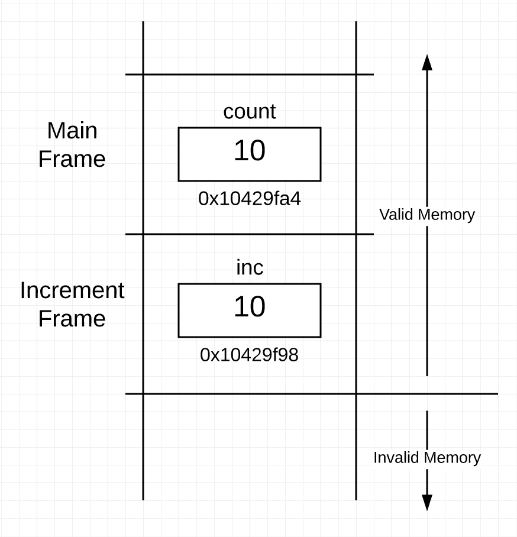

# 堆栈和指针的语言机制

## 序言

这是一个由四部分组成的系列文章中的第一篇，它将深入介绍在Go语言中指针、栈、堆、逃逸分析以及值/指针语义背后的机制和设计。本文将重点关注**栈和指针**。

## 帧边界

函数在**帧(栈帧)**边界的范围内执行，为**每个相应的函数提供了一个独立的内存空间**。每个帧允许函数在其自己的上下文中运行，并提供流程控制。函数通过帧指针直接访问其帧内的内存，但要访问帧外的内存则需要间接访问。为了使函数能够访问其帧外的内存，该内存必须与函数共享。首先需要理解并学习这些帧边界所建立的机制和限制。

当调用函数时，发生了两个帧之间的转换。代码从调用函数的帧中转移到被调用函数的帧中。如果在函数调用时需要数据，那么该数据必须从一个帧传输到另一个帧。在两个帧之间传递数据在Go语言中是通过“按值”进行的。

“按值”传递数据的好处在于可读性。在函数调用中看到的值就是被复制并在另一侧接收到的值。这就是为什么我将“按值传递”与所见即所得联系在一起，因为所见即所得。所有这些使您能够编写不隐藏两个函数之间转换成本的代码。这有助于保持对程序在发生转换时每个函数调用将如何影响程序的良好心理模型。

看一下这个执行整数数据“按值”传递的函数调用的小程序：

```go
01 package main
02
03 func main() {
04
05    // Declare variable of type int with a value of 10.
06    count := 10
07
08    // Display the "value of" and "address of" count.
09    println("count:\tValue Of[", count, "]\tAddr Of[", &count, "]")
10
11    // Pass the "value of" the count.
12    increment(count)
13
14    println("count:\tValue Of[", count, "]\tAddr Of[", &count, "]")
15 }
16
17 //go:noinline
18 func increment(inc int) {
19
20    // Increment the "value of" inc.
21    inc++
22    println("inc:\tValue Of[", inc, "]\tAddr Of[", &inc, "]")
23 }
```

当你的`Go`程序启动时，运行时会创建主`Goroutine`来开始执行所有的初始化代码，包括`main`函数中的代码。一个`Goroutine`是一条执行路径，它被放置在一个操作系统线程上，最终在某个核心上执行。从版本1.8开始，每个`Goroutine`都被分配一个初始的2,048字节的连续内存块，形成其栈空间。这个初始栈大小随着时间的推移已经发生了变化，并且在未来可能会再次发生变化。

栈是重要的，因为它为每个单独的函数提供了帧边界的物理内存空间。当主`Goroutine`执行`main`函数时，该`Goroutine`的栈（在很高的层次上）可能看起来像这样：

> 图 1


你可以在图中看到，栈的一部分已经被为main函数“划定”了。这部分被称为“栈帧”，正是这个帧标志着`main`函数在栈上的边界。帧是在调用函数时执行的代码的一部分来建立的。你还可以看到`count`变量的内存已经被放置在`main`帧内的地址`0x10429fa4。`

图中还明确指出了另一个有趣的观点。**在活动帧下面的所有栈内存都是无效的，而在活动帧及以上的内存是有效的**。我需要明确说明栈的有效和无效部分之间的边界。

## 地址

变量的作用是为一个特定的内存位置分配一个名称，以提高代码的可读性，并帮助你理解正在处理的数据。如果你有一个变量，那么你在内存中有一个值，而如果你在内存中有一个值，它必须有一个地址。在第09行，`main`函数调用内置函数`println`来显示`count`变量的“值”和“地址”。

```go
09    println("count:\tValue Of[", count, "]\tAddr Of[", &count, "]")
```

使用取地址运算符`&`来获取变量位置的地址并不新奇，其他语言也使用这个运算符。如果在32位体系结构上运行该代码，第09行的输出应该类似于以下输出：

```go
count:  Value Of[ 10 ]  Addr Of[ 0x10429fa4 ]
```

## 函数调用

接下来，在第12行，`main`函数调用了`increment`函数。

```go
12    increment(count)
```

进行函数调用意味着`Goroutine`需要在栈上划定一个新的内存段。然而，情况有点复杂。要成功进行这个函数调用，数据需要在帧边界之间传递，并在转换期间放入新的帧中。具体来说，在调用期望复制并传递的整数值。通过查看第18行上`increment`函数的声明，你可以看到这一要求。

```go
18 func increment(inc int) {
```

如果再次查看第12行对`increment`的函数调用，你会看到代码正在传递`count`变量的“值”。这个值将被复制、传递并放入`increment`函数的新帧中。请记住，`increment`函数只能直接读取和写入其自己帧内的内存，因此它需要inc变量来接收、存储和访问传递的`count`值的自己的副本。

在`increment`函数内部的代码开始执行之前，`Goroutine`的栈（在很高的层次上）可能如下所示：



现在你可以看到栈有两个帧，一个是`main`的，下面是一个`increment`的。在`increment`的帧内部，你可以看到`inc`变量，它包含了在函数调用期间复制并传递的值为10。`inc`变量的地址是`0x10429f98`，因为帧是沿着栈向下的，这只是一个实现细节，没有实际意义。重要的是`Goroutine`从`main`的帧内部获取了`count`的值，并使用`inc`变量在`increment`的帧内放置了该值的副本。

在`increment`函数内的其余代码会递增并显示`inc`变量的“值”和“地址”。

代码清单6

```go
21    inc++
22    println("inc:\tValue Of[", inc, "]\tAddr Of[", &inc, "]")
```

第22行的输出应该类似于：

```go
inc:    Value Of[ 11 ]  Addr Of[ 0x10429f98 ]
```

在执行这些代码的相同行之后，栈的情况如下


在执行第21和22行后，`increment`函数返回，控制流回到`main`函数。然后，`main`函数再次在第14行显示局部变量`count`的“值”和“地址”。

```go
14    println("count:\tValue Of[",count, "]\tAddr Of[", &count, "]")
```

程序的完整输出应该类似于：

```go
count:  Value Of[ 10 ]  Addr Of[ 0x10429fa4 ]
inc:    Value Of[ 11 ]  Addr Of[ 0x10429f98 ]
count:  Value Of[ 10 ]  Addr Of[ 0x10429fa4 ]
```

在`main`的帧中，`count`的值在调用`increment`之前和之后是相同的。

## 函数返回

当一个函数返回并控制返回到调用函数时，栈上的内存实际上会发生什么？简短的答案是什么都没有。这是在`increment`函数返回后栈的情况：


栈看起来与图3完全相同，只是与`increment`函数关联的帧现在被认为是无效内存。这是因为`main`的帧现在是活动帧。为`increment`函数划定的内存保持不变。

清理返回函数帧的内存将是一种浪费，因为你不知道那块内存是否会再次被需要。因此，内存保持原样。在每次函数调用时，当帧被划定时，该帧的栈内存会被清空。这是通过初始化放置在帧中的任何值来完成的。因为所有值至少被初始化为它们的“零值”，所以栈在每次函数调用时都会正确地自我清理。

## 共享值

如果`increment`函数直接操作`main`帧内存在的`count`变量很重要，那么指针就派上了用场。指针有一个目的，就是与函数共享一个值，以便函数可以读取和写入该值，即使该值并不直接存在于函数自己的帧内。

如果“共享”这个词没有出现在你的口中，你就不需要使用指针。在学习指针时，使用清晰的词汇而不是运算符或语法是很重要的。所以记住，指针是用于共享的，并在阅读代码时用“共享”这个词替代&运算符。

## 指针类型

对于每个由你或语言本身声明的类型，你都会免费获得一个相应的用于共享的补充指针类型。已经存在一个名为`int`的内置类型，因此有一个称为`int`的补充指针类型。如果声明了一个名为`User`的类型，你会免费获得一个称为`User`的指针类型。

所有指针类型都具有相同的两个特性。首先，它们以字符*开头。其次，它们都具有相同的内存大小和表示，即表示地址的4或8字节。在32位体系结构上，指针需要4字节的内存，在64位体系结构上，它们需要8字节的内存。

在规范中，指针类型被视为类型文法，这意味着它们是由现有类型组成的未命名类型。

## 间接内存访问

看一下这个执行通过地址“按值”传递的函数调用的小程序。这将共享`main`栈帧中的`count`变量给`increment`函数：

```go
01 package main
02
03 func main() {
04
05    // Declare variable of type int with a value of 10.
06    count := 10
07
08    // Display the "value of" and "address of" count.
09    println("count:\tValue Of[", count, "]\t\tAddr Of[", &count, "]")
10
11    // Pass the "address of" count.
12    increment(&count)
13
14    println("count:\tValue Of[", count, "]\t\tAddr Of[", &count, "]")
15 }
16
17 //go:noinline
18 func increment(inc *int) {
19
20    // Increment the "value of" count that the "pointer points to". (dereferencing)
21    *inc++
22    println("inc:\tValue Of[", inc, "]\tAddr Of[", &inc, "]\tValue Points To[", *inc, "]")
23 }
```


在这个程序中与原始版本相比进行了三个有趣的修改。这是第一个修改，出现在第12行：

```go
12    increment(&count)
```

这一次在第12行，代码不是复制和传递`count`的“值”，而是`count`的“地址”。现在你可以说，我正在与`increment`函数“共享”`count`变量。这就是&运算符的作用，“共享”。

要理解的是，**这仍然是“按值传递”，唯一的区别是你传递的值是一个地址而不是一个整数**。地址也是值；这是在函数调用的帧边界上被复制和传递的内容。

由于正在复制和传递地址的值，你需要在increment的帧内部声明一个变量来接收和存储这个基于整数的地址。这就是在第18行进行整数指针变量声明的地方。

```go
18 func increment(inc *int) {
```

如果你正在传递`User`值的地址，那么变量就需要声明为`*User`。**尽管所有指针变量都存储地址值，但它们不能传递任何地址，只能传递与指针类型相关联的地址**。这是关键，共享值的原因是因为接收函数需要对该值执行读取或写入操作。你需要任何值的类型信息才能读取和写入。编译器将确保仅与正确指针类型关联的值与该函数共享。

在调用`increment`函数后，栈的情况如下：


在图5中，你可以看到当使用地址作为值执行“按值传递”时，栈的情况是怎样的。`increment`函数帧内的指针变量现在指向了`main`帧内的`count`变量。

现在，使用指针变量，函数可以对`main`帧内的`count`变量执行间接读取修改写入操作。

```
21    *inc++
```

这次\*字符充当了一个运算符，并应用于指针变量。使用\*作为运算符意味着“指针指向的值”。指针变量允许在使用它的函数帧之外进行间接内存访问。有时，这种间接读取或写入被称为对指针进行解引用。`increment`函数仍然必须在其帧内有一个指针变量，可以直接读取以执行间接访问。

现在在图6中，你可以看到在执行第21行后栈的情况。


这是该程序的最终输出：

```go
count:  Value Of[ 10 ]       		 Addr Of[ 0x10429fa4 ]
inc:    Value Of[ 0x10429fa4 ]   Addr Of[ 0x10429f98 ]   Value Points To[ 11 ]
count:  Value Of[ 11 ]       		 Addr Of[ 0x10429fa4 ]
```

你可以看到inc指针变量的“值”与`count`变量的“地址”相同。这建立了允许发生帧外间接访问的共享关系。一旦通过指针执行了写操作，当控制返回时，`main`函数就能看到变化。

指针变量并不特殊 指针变量并不特殊，因为它们就像任何其他变量一样。它们有一个内存分配并保存一个值。巧合的是，所有指针变量，无论它们可以指向的值的类型如何，始终具有相同的大小和表示。可能会让人感到困惑的是*字符在代码内部充当运算符，并用于声明指针类型。如果你能区分类型声明和指针操作，这可以帮助减轻一些混淆。

结论 本文介绍了指针背后的目的以及在`Go`中堆栈和指针机制的工作原理。这是理解编写一致和可读代码所需的机制、设计哲学和准则的第一步。

总结一下，你学到了什么：

- 函数在提供各自内存空间的帧边界的范围内执行。
- 当调用函数时，两个帧之间会发生转换。
- “按值传递”数据的好处是可读性。
- 栈很重要，因为它为每个单独的函数提供了帧边界的物理内存空间。
- 活动帧下面的所有栈内存都是无效的，而活动帧及以上的内存是有效的。
- 进行函数调用意味着`Goroutine`需要在栈上划定一个新的内存段。
- 在每次函数调用时，帧被划定，该帧的栈内存被清空。
- 指针的目的是与函数共享一个值，以便函数可以读取和写入该值，即使该值并不直接存在于其自己的帧内。
- 对于每个声明的类型（无论是你还是语言本身声明的），你都会免费获得一个用于共享的补充指针类型。
- 指针变量允许在使用它的函数帧之外进行间接内存访问。
- 指针变量并不特殊，因为它们就像任何其他变量一样。它们有一个内存分配并保存一个值。

# 来源

[翻译]https://www.ardanlabs.com/blog/2017/05/language-mechanics-on-stacks-and-pointers.html