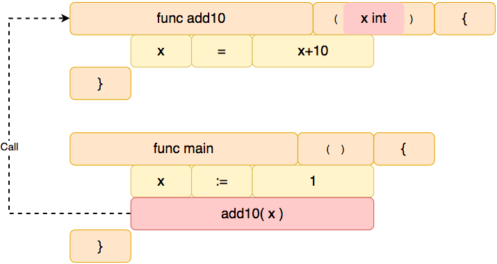
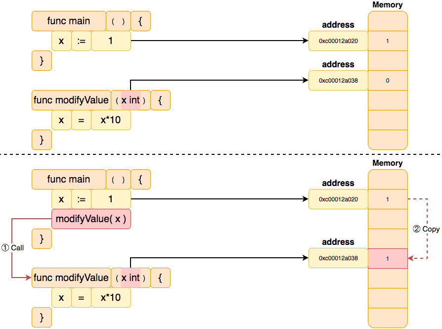
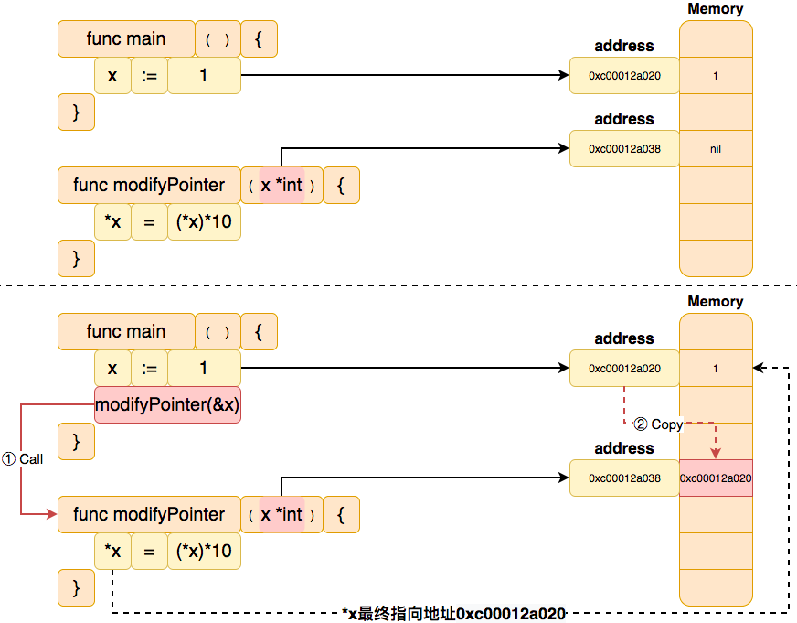
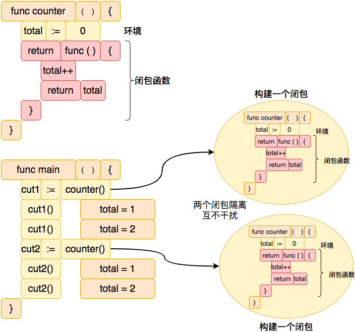
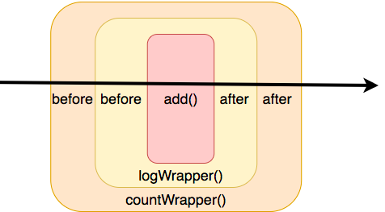
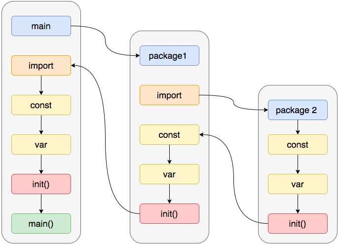

# 函数

在 ` Go ` 语言中，函数是一种**基本的代码块**，用于执行某些操作并返回结果。通过函数来划分不同功能， 我们可以将不同的功能封装成不同的函数，减少主干逻辑的复杂度。



## 目录

- 定义函数

- 匿名函数
- `init()` 函数调用

## 函数定义

在`Golang`中通过关键字`func`定义一个函数, 并指定函数名称、参数列表和返回类型。 格式:

```go
func functionName(parameterName T,....) resultName T ...{}
```

使用实例：

```go
package main

import "fmt"

/* 定义函数格式
func name([parameter list]) [return_type list] {
  do some things
}
*/

// 定义一个 print 函数, 它接受 0 个参数，返回 0 个值
func print() {
	fmt.Println("hello world")
}

// 定义一个 add 函数, 它接受 2 个 int 类型的参数,返回 1 个 int 类型的值
func add(x int, y int) int {
	return x + y
}

// 定义一个 swap 函数, 它接受 2 个 int 类型的参数,返回 2 个 int 类型的值
func swap(x, y int) (int, int) {
	return y, x
}

// 返回值可被命名(a,b)，它们会被视作定义在函数顶部的变量
func swap2(x, y int) (a int, b int) {
	a = y
	b = x
	return
}

// 传递不定长参数 ...T
func variableCut(x int, y ...int) int {
	for _, v := range y {
		x += v
	}
	return x
}

func main() {
	// 调用 print() 函数
	print()

	// 调用 add() 函数并传递 2 个 int 类型数据 1 和 2
	fmt.Printf("add() return: %d\n", add(1, 2))

	// 调用 swap() 函数并传递 2 个 int 类型数据 1 和 2 并接收两个返回 x 和 y
	x, y := swap(1, 2)
	fmt.Printf("swap() x: %d, y: %d \n", x, y)

	// 调用 variableCut() 函数并传递 1 个 int 类型数据 1 和 1个不定长的 int 类型数据 2,3,4,5
	fmt.Printf("advariableCutd() return: %d\n", variableCut(1, 2, 3, 4, 5))
}
```

**变量传递与指针变量传递的区别**

```go
package main

import "fmt"

// 值类型参数
func modifyValue(x int) {
	x = x * 10
}

// 指针类型参数
func modifyPointer(x *int) {
	*x = (*x) * 10
}

// 值类型参数
func printValue(j int) {
	fmt.Printf("value addr:%p\n", &j)
}

// 指针类型参数
func printPointer(j *int) {
	fmt.Printf("value addr:%p\n", j)
	fmt.Printf("pointer addr:%p\n", &j)
}

func main() {
	// 值类型参数与指针类型参数的区别
	//		值类型参数是指在调用函数时将实际数据复制一份传递给函数中对应的接受参数,这样在函数中如果对参数进行修改，将不会影响到外面的数据
	//		指针类型参数(引用传递)是指在调用函数时将实际数据的地址复制一份传递给函数中对应的指针接受参数，那么在函数中对参数进行的修改，将影响到外面的数据
	// 不管是值类型参数还是指针类型参数都是【值传递】，只是传递的是值数据还在指针地址数据
	x = 1
	modifyValue(x)
	fmt.Printf("modifyValue() return: %d\n", x)

	x = 1
	modifyPointer(&x) // 和 modifyValue 区别是使用了 &
	fmt.Printf("modifyPointer() return: %d\n", x)

	// 参数传递的数据地址
	j := 10
	fmt.Printf("value addr:%p\n", &j)
	printValue(j)
	printPointer(&j)
}
```

如上代码中`modifyValue(x int)`接收一个值变量参数,在函数中对参数进行修改，将不会影响到传入的变量的值, 因为它们属于不同的内存空间(`0xc00012a020,0xc00012a038`),所以是相互隔离的。



然而`func modifyPointer(x *int)`接收一个指针变量参数,在函数中对参数进行修改，将会影响到传入的指针变量指向的值,虽然它们属于不同的内存空间(`0xc00012a020,0xc00012a038`), 但是`0xc00012a038`的值指向了`0xc00012a020`, 可以通过`*`操作符改变指针变量指向的最终值。



## 匿名函数

> 该部分代码在上一节中**定义函数变量**介绍过，当前小节以偏向于匿名函数方向来介绍。

在 `Golang` 中，**匿名函数**是指**没有名称的函数**。这种函数可以直接定义在函数体中，也可以作为变量赋值给其他变量或作为参数传递给其他函数。匿名函数在实现一些简单的功能或者对于函数体较小的函数时非常方便，可以避免编写大量重复的代码。

```go
package main

import (
	"fmt"
)

// compute函数(有名字的函数),接收两个整数，以及一个匿名函数作为参数。
func compute(x, y int, handler func(x, y int) int) int {
	x = x * 10
	y = y * 10
    result := handler(x, y)
	return result
}

// 匿名函数
func main() {
	// 第1部分 定义匿名函数并赋值给add变量
	var add = func(x, y int) int {
		return x + y
	}
	fmt.Println("add", add(1, 2)) // 调用匿名函数

	// 第2部分 定义匿名函数并赋值给Multi变量
	Multi := func(x, y int) int {
		return x * y
	}
	fmt.Println("Multi", compute(1, 2, Multi)) // 传递匿名函数
}
```

在上面的示例中第1部分，我们在 `main` 函数中定义了一个名为 `add` 的匿名函数，它接受两个整数作为参数并返回它们的和。然后调用 `add` 匿名函数变量，将其作为一个普通的函数来计算 1 + 2 的和，最后将结果输出到控制台上。

在上面的示例中第2部分，我们定义了一个匿名函数`Multi`，它接受两个整数作为参数并返回它们的乘积。然后，我们定义了一个函数 `compute`，它接受两个整数，以及一个匿名函数作为参数。`compute` 函数会调用传入的函数`handler`，并将两个整数+10后作为参数传递给它。最后，我们在 `main` 函数调用 `compute` 函数，将两个整数和 `Multi`函数作为参数传递给它，然后将结果输出到控制台上。

## 闭包

在 Go 语言中，**闭包**简单来说是**一种引用了外部变量的匿名函数**，它可以访问外部作用域中的变量，即使外部作用域被销毁。

`闭包` = `匿名函数` + `引用环境`

**闭包把匿名函数和运行时的引用环境打包成为一个新的整体**，当每次调用包含闭包的函数时都将返回一个新的闭包实例，这些实例之间是隔离的，分别包含调用时不同的引用环境现场。不同于函数，闭包在运行时可以有多个实例，不同的引用环境和相同的匿名函数组合可以产生不同的实例。



```go
package main

import "fmt"

func counter() func() int {
	total := 0 // 闭包打包的外部作用域环境
	return func() int { // 闭包函数
		total++
		return total
	}
}

func Steps1() {
	f := counter()
	fmt.Printf("\tnum: %d\n", f()) // 输出 1
	fmt.Printf("\tnum: %d\n", f()) // 输出 2
	fmt.Printf("\tnum: %d\n", f()) // 输出 3
	fmt.Printf("\t-------\n")
	ff := counter()
	fmt.Printf("\tnum: %d\n", ff()) // 输出 1
	fmt.Printf("\tnum: %d\n", ff()) // 输出 2
	fmt.Printf("\tnum: %d\n", ff()) // 输出 3
}

func main() {
	fmt.Println("Steps1():")
	Steps1()
}
```

如上代码`counter()`函数中返回了一个闭包, 这个闭包通过匿名函数`func() int{ }`打包了`total环境` (这个闭包其实是一个整数计数器)。在 `Steps1()` 函数中，我们使用 `counter` 函数分别创建了两个闭包 `f` 和 `ff`，并分别调用它们并输出计数器的值。

需要注意的是，由于 `counter` 函数返回的是一个闭包函数，而不是一个整数，所以我们需要使用 `()` 操作符来调用闭包函数并获取计数器的值。

**闭包在 Go 语言中是一个非常强大的编程技巧，可以用于实现函数工厂、延迟计算、函数递归等复杂的编程场景。**不过，由于闭包函数可以访问其外部作用域中的变量，因此在使用闭包时需要特别小心，以避免出现并发访问和变量泄露等问题。

通过闭包实现修饰器函数:

```go
package main

import (
	"fmt"
	"reflect"
	"runtime"
)

/*
	需求：给add()函数添加添加调用日志
*/

// 缺陷：
// 1.和业务代码耦合
// 2.每个类似业务都要添加额外日志打印逻辑
func addX(x, y int) int {
	fmt.Printf("\tCalling addX function")
	result := x + y
	fmt.Printf("\tCalling addX function returned %v \n", result)
	return result
}

func add(x, y int) int {
	return x + y
}

// 通过函数实现 日志修饰器
// 缺陷：
// 1.每个调用的地方都需要包裹一层
func logAdd(x, y int, fn func(x, y int) int) int {
	fmt.Printf("\tlogAdd Calling function %v \n", runtime.FuncForPC(reflect.ValueOf(fn).Pointer()).Name())
	result := fn(x, y)
	fmt.Printf("\tlogAdd Function returned %v \n", result)
	return result
}

func Steps3() {
	logAdd(1, 2, add) // 调用add时包裹一层
}

// 通过闭包实现 日志修饰器
// 缺陷：
// 1.入参格式和返回格式需要固定
func logWrapper(fn func(x, y int) int) func(x, y int) int {
	return func(x, y int) int {
		fmt.Printf("\tlogWrapper Calling function %v \n", runtime.FuncForPC(reflect.ValueOf(fn).Pointer()).Name())
		result := fn(x, y)
		fmt.Printf("\tlogWrapper Function returned %v \n", result)
		return result
	}
}

func Steps3Plus() {
	wrappedAdd := logWrapper(add)
	wrappedAdd(2, 3)
}

func main() {
	fmt.Println("Steps3():")
	Steps3()
	fmt.Println("Steps3Plus():")
	Steps3Plus()
}
```

通过`type Handler func(x, y int) int`改造`logWrapper()`修饰器函数:

```go
package main

import (
	"fmt"
	"reflect"
	"runtime"
)

// Handler 是通过type给func(x, y int) int起的别名(简化开发)
type Handler func(x, y int) int

// add 也是一个Handler
func add(x, y int) int {
	return x + y
}

// 入参为Handler返回为也为Handler
func logWrapper(handler Handler) Handler {
	return func(x, y int) int {
		fmt.Printf("\tlogWrapper Calling function %v \n", runtime.FuncForPC(reflect.ValueOf(handler).Pointer()).Name())
		result := handler(x, y)
		fmt.Printf("\tlogWrapper Function returned %v \n", result)
		return result
	}
}

func countWrapper(handler Handler) Handler {
	countX := 0
	return func(x, y int) int {
		fmt.Printf("  {\n")
		fmt.Printf("\tcountWrapper Calling function %v \n", runtime.FuncForPC(reflect.ValueOf(handler).Pointer()).Name())
		result := handler(x, y)
		fmt.Printf("\tcountWrapper Calling function count %v \n", countX)
		fmt.Printf("  }\n")
		countX++
		return result
	}
}

func main() {
	// 修饰器函数countWrapper包裹logWrapper，logWrapper包裹add
	wrappedCount := countWrapper(logWrapper(add))
	wrappedCount(2, 3)
	wrappedCount(3, 3)
	wrappedCount(4, 3)
}
```



## Init函数

在 `Golang` 中，`init` 函数是一个特殊的函数，用于在**程序执行前自动执行一些初始化操作**，例如初始化全局变量或加载配置文件等。`init` 函数没有任何参数和返回值，并且不能被显式调用。当程序启动时，`Go` 会自动在主函数执行之前调用所有包中的 `init` 函数，包括导入的所有包的 `init` 函数, `init()`函数执行完成后再执行`main()`函数

```go
package main

import (
	"fmt"
)

// init 函数会在 main 函数之前执行，而且无需调用就会执行
func init() {
	fmt.Println("Golang Tutorial")
}

func main() {
	fmt.Println("Hello World")
}
```

跨包的`init()`函数调用

```go
package main

import (
	"fmt"
	_ "golang-tutorial/3-function/test" // 引用 test 包, 会先执行 test 包的init函数
)

// init 函数会在 main 函数之前执行，而且无需调用就会执行
func init() {
	fmt.Println("Golang Tutorial")
}

func main() {
	fmt.Println("Hello World")
}
```

注意, `Go` 语言的初始化顺序是先导入所有包，然后按照包导入的顺序依次初始化每个包中的 `const`、`var` 和 `init`, 最后调用 `main` 函数。



## 思考题

1. 通过传参实现加减乘除这四个函数,如: 加法函数
```go
func add(a,b int) int {
	return a+b
}
```

2. 通过指针的方式实现加减乘除这四个函数，要求：加减乘除不能通过返回参数的形式收集结果
3. 通过init函数给初始化全局变量str的值为"Hello Golang tutorial"

## 自检

- 函数的定义和调用 ？
- 函数的参数 ？
- 函数的不定长参数 ？
- 函数的指针参数 ?
- 函数的返回值和多返回值 ？
- 函数作为变量和参数传递 ？
- 匿名函数 ？
- 闭包 ？

- `init`函数的定义和作用 ？
- `init`函数的执行顺序 ?
- 同一包内多个`init`函数的执行顺序 ?
- `init`函数的注意事项 ?

## 参考

https://llmxby.com/2022/08/27/%E6%8E%A2%E7%A9%B6Golang%E4%B8%AD%E7%9A%84%E9%97%AD%E5%8C%85/

https://www.cnblogs.com/mfrank/p/13383467.html

https://stackoverflow.com/questions/24790175/when-is-the-init-function-run/49831018#49831018