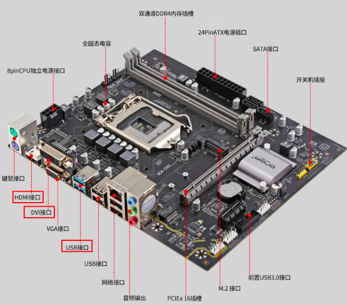

# Interface

在电脑主板上，有不同的接口（例如`USB`、`HDMI`、音频接口等），它们可以用来连接不同的外部设备（例如鼠标、键盘、显示器、扬声器等）。这些接口提供了一种标准的协议，允许不同的设备进行通信和交互。



在`Golang`中，`interface`的作用就类似于电脑主板上的接口。**它是一种类型，用于定义一组方法签名**，一个**实现了这组方法的具体类型**被称为这个`interface`的**实现类型**。就像`USB`接口一样, `USB`定义了插口大小, 金属引脚数量等; 任何品牌的鼠标,键盘等外部组件只要按照`USB`规定的插口大小,引脚数量进行制作,就能插到USB接口上并使用。

`interface`类型是一种抽象的类型，它不会暴露出所包含的具体值的内部结构和数据。同时`interface` 类型可以代表任意类型的值，因此它可以用来定义不同类型的值。

## 目录

- 接口定义与实现
- 接口应用举例
- 接口断言

## 接口定义与实现

定义接口语法格式: 

```go
type interfaceName interface {
	functionName() // 方法组
    ......
  // functionName2(type) type
}
```

`type`和`interface`为关键字, `interfaceName`为接口名称, `functionName()`为接口方法组中的一个方法名称, 举例如下：

```go
// 定义了一个名称为 Duck 的接口
type Duck interface {
	GaGaga() // 只包含一个方法 GaGaga()  
}
```

实现接口：**必须要实现接口的所有方法才能被叫做实现该接口**

```go
type BlackSwan struct {
	Name  string
	Color string
}

// BlackSwan 实现了GaGaga()方法
func (d BlackSwan) GaGaga() {
	fmt.Printf("%s, ga ga ga\n", d.Name)
}
```

调用接口方法

```go
func main() {
	var d Duck // 定义了一个 Duck 接口名称为d

	d = BlackSwan{ // 将定义的BlackSwan实例赋值给d，因为BlackSwan实现了Duck接口
		Name:  "黑天鹅",
		Color: "黑色",
	}
	d.GaGaga() // 调用接口定义的方法，且只能调用定义过的方法
}
```

定义并实现一个接口：

```go
package main

import "fmt"

/*
	1.通过接口定义方法
	2.实现接口定义方法
*/

// Duck 接口类型 定义一组方法签名的集合
type Duck interface {
	GaGaga() // 定义接口约定
	// ....
}

// 定义一个新类型(相当于给string起了个别名)
type DonaldDuck string

// DonaldDuck 实现了GaGaga()函数
func (d DonaldDuck) GaGaga() {
	fmt.Printf("%s, ga ga ga\n", d)
}

type RubberDuck string

// RubberDuck 实现了GaGaga()函数
func (d RubberDuck) GaGaga() {
	fmt.Printf("%s, ga ga ga\n", d)
}

type BlackSwan struct {
	Name  string
	Color string
}

// BlackSwan 实现了GaGaga()函数
func (d BlackSwan) GaGaga() {
	fmt.Printf("%s, ga ga ga\n", d.Name)
}

func main() {
	var d Duck

	// 可以将DonaldDuck具体类型赋值给接口Duck类型，因为实现了接口类型的方法集合
	d = DonaldDuck("🦆 唐老鸭")
	d.GaGaga()

	d = RubberDuck("🦆 小黄鸭")
	d.GaGaga()

	d = BlackSwan{
		Name:  "黑天鹅",
		Color: "黑色",
	}
	d.GaGaga()
}
```

以上代码定义了一个接口类型 `Duck`，并定义了三个实现该接口的具体类型 `DonaldDuck`、`RubberDuck`、 `BlackSwan`。

其中，`DonaldDuck` 和 `RubberDuck` 都实现了 `GaGaga()` 方法，可以输出 `xxx, ga ga ga` 的字符串，而 `BlackSwan` 类型也实现了 `GaGaga()` 方法，输出 `xxx, ga ga ga`。

然后，在 `main` 函数中，定义了一个 `Duck` 类型的变量 `d`，并将 `DonaldDuck`、`RubberDuck` 和 `BlackSwan` 类型的变量赋值给 `d`，这是因为这三个类型都实现了 `Duck` 接口，所以可以赋值给 `Duck` 类型的变量。

然后分别调用 `d` 的 `GaGaga()` 方法，根据不同的类型，输出不同的字符串。

```go
package main

import "fmt"


// Duck 接口类型 定义一组方法签名的集合
type Duck interface {
	GaGaga() // 定义接口约定
	// ....
}

type Dog struct {
	Name string
}

// Dog 实现了GaGaga()函数
func (d Dog) GaGaga() {
	fmt.Printf("%s, ga ga ga\n", d.Name)
}

func (d Dog) WangWangWang() {
	fmt.Printf("%s, wang wang wang\n", d.Name)
}

func main() {
	var d Duck

  // 接口与具体实现类调用时的对比
	d = Dog{
		Name: "小狗",
	}
	d.GaGaga()

	dog := Dog{
		Name: "哈士奇",
	}
	dog.GaGaga()
	dog.WangWangWang()
	fmt.Println(dog.Name)
}
```

**总结:** 接口类型通常用于将具体类型的**实现细节与实现类型**的名称**分离**开。这种机制提供了非常强大的面向对象编程能力，使得`Go`语言的面向对象编程变得更加自然和简单。它可以**帮助**我们**构建高度抽象的代码**，使代码更加灵活、易于维护和扩展。

## 接口应用举例

```go
package main

import (
	"fmt"
	"math/rand"
	"time"
)

// Hero 定义一个英雄接口，包含：
// 1.释放技能方法 Skills
// 2.添加装备方法 AddEquipments
// 3.上下左右移动方法 Move
type Hero interface {
	Skills(index int)
	AddEquipments(eq string)
	Move(direction string)
}

// Houyi 英雄后裔实现 Hero 接口
type Houyi struct {
	Equipments []string
}

func (h Houyi) Skills(index int) {
	fmt.Printf("\t 释放技能 %d\n", index)
}

func (h Houyi) AddEquipments(eq string) {
	h.Equipments = append(h.Equipments, eq)
	fmt.Printf("\t 添加装备 %s\n", eq)
}

func (h Houyi) Move(direction string) {
	fmt.Printf("\t 向 %s 移动\n", direction)
}

var move = []string{"上", "下", "左", "右"}
var equipments = []string{"斗篷", "电刀", "黑切", "破军"}
var skills = []int{1, 2, 3, 4}

// operation 操作者(玩家)
// 注意operation() 接收的是 Hero 接口，这是非常重要的，这也是接口的最重要的应用
func operation(h Hero) {
	fmt.Println("开始王者操作：")
	rand.Seed(time.Now().UnixNano())
	for i := 0; ; i++ {
		tmp := i % 4
		switch tmp {
		case 0:
			m := move[rand.Intn(len(move)-1)]
			h.Move(m)
		case 1:
			s := skills[rand.Intn(len(skills)-1)]
			h.Skills(s)
		case 2:
			e := equipments[rand.Intn(len(equipments)-1)]
			h.AddEquipments(e)
		}
		time.Sleep(2 * time.Second)
	}
}

func main() {
	var hy = Houyi{}
	operation(hy)
}
```

如上代码中，我们定义了一个结构体`Houyi`，该结构体实现了`Hero`这个接口；我们还定义了`func operation(h Hero)`函数，这个函数接收一个`Hero`的接口类型参数，因此只要实现了`Hero`接口的类型就可以传递给该函数。所以我们可以将`Houyi`的实例`hy`传递给该函数。

## 接口断言

接口断言是指从一个接口类型中提取出具体的值和类型信息的操作。在 `Golang` 中，接口断言可以使用类型断言的方式进行实现。如果一个接口变量 `x` 的底层类型是 `T` 类型，我们可以使用 `x.(T)` 的方式对其进行类型断言，其中 `.(T)` 表示将 `x` 转换为 `T` 类型。

```go
package main

import "fmt"

// 类型断言
// 断言 interface
func main() {
	var i interface{} = "hello"

	s := i.(string)
	fmt.Println(s)

	// 类型断言, 断言失败一般会导致panic的发生, 所以为了防止panic的发生, 我们需要在断言时进行一定的判断。
	// 如果断言失败, 那么ok的值将会是false
	// 如果断言成功, 那么ok的值将会是true, 同时s将会得到正确类型的值。
	s, ok := i.(string)
	fmt.Println(s, ok)

	f, ok := i.(float64)
	fmt.Println(f, ok)

	f = i.(float64) // 如果断言失败 报错(panic)
	fmt.Println(f)
}
```

在代码中，变量 `i` 的类型为 `interface{}`，表示它可以保存任何类型的值。然后使用 `.(string)` 进行类型断言，将其转换为字符串类型，并将结果赋值给变量 `s`。

接下来使用类型断言和布尔值的组合形式，将 `i` 断言为字符串类型，并将结果分别赋值给 `s` 和 `ok`。由于 `i` 的实际类型是字符串类型，因此断言成功，`ok` 的值为 `true`，`s` 得到了正确类型的值。

然后尝试将 `i` 断言为 `float64` 类型，由于实际类型是字符串类型，这次断言失败，`ok` 的值为 `false`，`f` 的值为 `0`。

最后尝试将 `i` 直接断言为 `float64` 类型，由于实际类型是字符串类型，并且没有**接收**断言结果，所以这次断言会**导致 panic 异常的发生**。

## 为什么需要接口

- 接口允许 `Go` 具有多态性, 在需要多态性的 `Go` 中使用接口。
- 在可以传递多种类型的函数中，可以使用接口。

- 接口还用于帮助减少重复/样板代码。

在需要动态类型参数的函数和方法的情况下，接口非常有用，例如接受任何类型值的 `Println` 函数。

## 思考题

## 自检

- `interface`的定义和声明 ？
- `interface`的类型断言 ？
- `interface`空的使用 ？
- `interface`的比较 ？
- `interface`的底层原理 ？
- `interface`的实现方式 ？

## 参考

https://blog.knoldus.com/how-to-use-interfaces-in-golang/

https://stackoverflow.com/questions/39092925/why-are-interfaces-needed-in-golang

https://stackoverflow.com/questions/23148812/whats-the-meaning-of-interface

https://blog.boot.dev/golang/golang-interfaces/

https://golangbyexample.com/interface-in-golang/

https://betterprogramming.pub/a-comprehensive-guide-to-interfaces-in-go-6a945b795db

https://make-sense.tech/type-convertion-of-slice-in-go