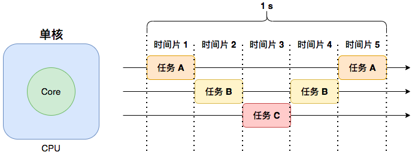
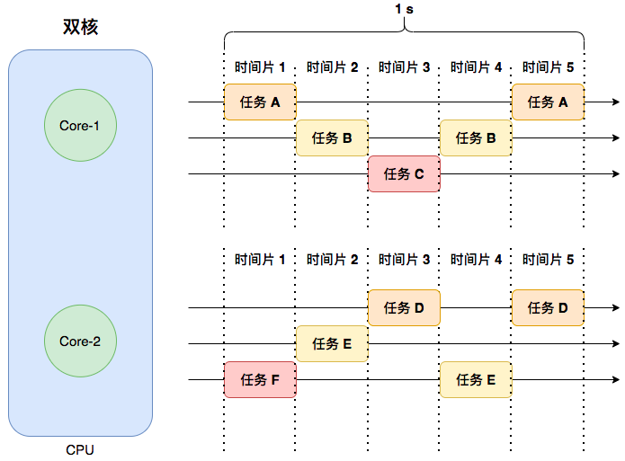
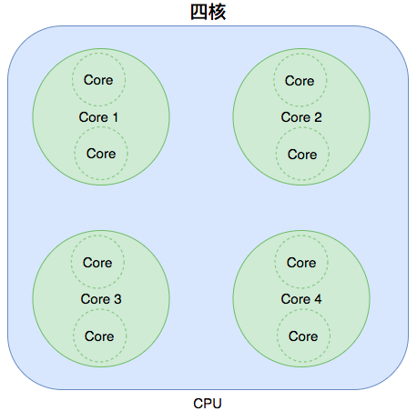
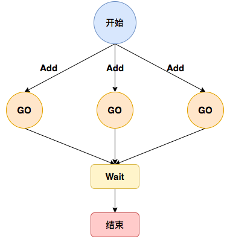
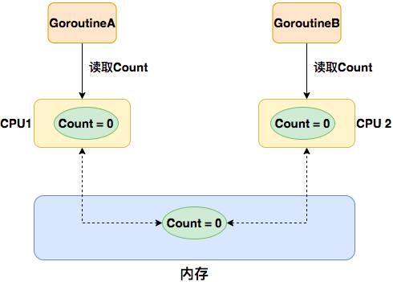
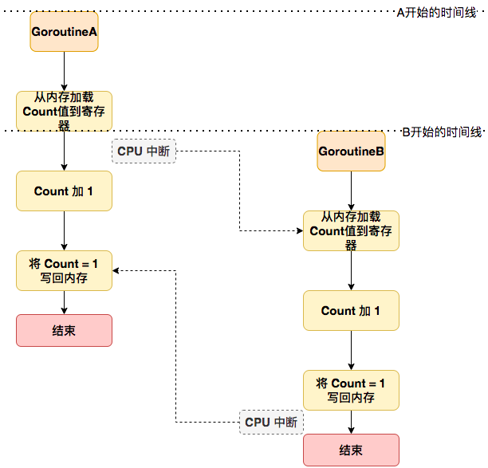
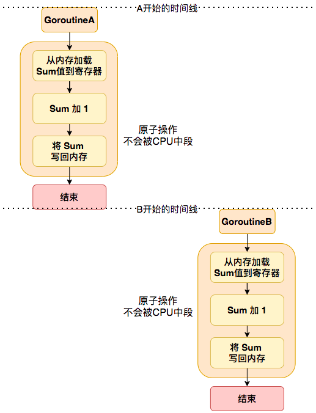
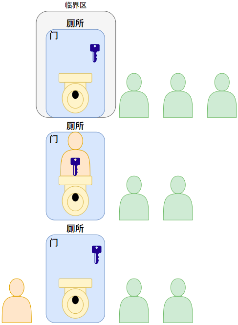

# Goroutine

`Goroutine` 是 `Go` 语言中提供**并发处理**的方式。在学习`Goroutine`之前，我们先了解下什么是并发？什么是并行。

- 并发：**一段时间内**执行多个任务，这意味着**仅需一个物理核心**就能实现。

> 并发本质是我们的感知问题，就像电影闪电侠一样，普通人1s只能做一件事，而闪电侠1s可以做很多件事情，这导致我们产生了**错觉**，觉得闪电侠在1s内同时做这些事; 
>
> 其实闪电侠只是在0.1s做了A事，在0.2s做了B事情，在0.3s做了C事，只是闪电侠做的太快了，普通人类没法在短短的0.1s感知到而已。当1s后感知到时，发现A,B,C都做完了，这就产生了闪电侠在1s内同时做这些事的**错觉**。

在现实中`CPU`的执行是非常快的，我们通过将`CPU`的执行时间划分为不同的时间片来执行任务。下图中 `CPU`在1 s内并发的运行了3个任务(`A,B,C`)，这里将`CPU`的1s执行时间划分为了5个**时间片**，用来分别执行这些任务。



图中在**时间片1**内`CPU`加载任务`A`并执行，当**时间片1**执行完后，`CPU`会将任务`A`移出然后开始**时间片2**，在**时间片2**中`CPU`会加载任务`B`并执行，接下来会按照这种方式依次执行任务`C`，任务`B`，任务`A`；为什么还会执行任务`B`和任务`A`？因为任务`AB`可能在**时间片1和2**没有执行完就被移出了，所以在后面的时间片又被加载执行。

在`CUP`执行时间片中，无论任务`A,B,C`本身是否执行完，当时间片耗尽后都会被移出`CPU`，这个加载和移出的过程叫做**上下文切换**。

- 并行：**同一时刻**执行多个任务，这意味着**至少需要2个物理核心**才能实现。

并行指严格意义上的**同一时刻**执行2个或2个以上的任务，这取决于你的`CPU`核心数。



上图中一个`CPU`至少有两个物理核心`Core`，每个核心上都运行着不同的任务。任务`A`和任务`B`分别运行在**时间片1**和**时间片2**上并且都运行在`Core-1`的核心上，这意味着任务`A`和任务`B`是**并发运行**的; 

而任务`A`和任务`F`都运行在**时间片1**上(代表同一时刻)，并且他们分别运行在`Core-1`和`Core-2`的核心上，所以他们是**并行运行**的。

为什么说一个`CPU`至少有两个物理核心`Core`？

 因为现代的**一颗CPU上可能会有多个核心**，又因为**超线程技术**，一个物理核心可以当做两个虚拟核心使用，所以理论上一个核心在**同一时刻可以并行执行2个任务**。而一般一个`CPU`具有4个核心，意味着这个`CPU`同一时刻可以**并行运行8个任务**(4*2=8)。



上文中的任务具体代表什么喃？

上文的一个任务代表一个线程，这些线程在不同的`CPU`时间片上运行，这些线程都是由内核进行调度。而我们在`Go`中的`Goroutine` 也可以看作是一个**轻量级线程**，它是由`Go`的  `Goroutine` 调度器来调度的，具体的细节可以看这两篇文章来了解：[Golang 调度器 GMP 原理与调度全分析](https://learnku.com/articles/41728)和[GMP 并发调度器深度解析](https://strikefreedom.top/archives/high-performance-implementation-of-goroutine-pool)

我们的一个`Go`程序可以启动**成百上千**个 `Goroutine`。`Goroutine` 的启动非常快，只需要几纳秒的时间, 而且不需要开发者手动进行线程调度，都由 `Go` 的`Goroutine`调度器自动完成，接下来我们就来了解一下`Goroutine`。

## 目录

- `Goroutine` 基础用法
- `Goroutine` 中 `sync.WaitGroup` 的使用
- `Goroutine` 小实验: 并发的下载图片
- `Goroutine` 的并发安全问题
  - 原子操作
  - 加锁保护

## Goroutine基础

`Golang`中想要**并发的执行一段逻辑**可以**通过`go`关键字+匿名函数或有名函数实现**, 代码如下: 

```go
// 匿名函数
go func() {
    // goroutine 执行的代码
}()


// 有名函数
func test(){
  fmt.Printf("golang tutorial\n")
}
go test()
```

一个`go func()`会启动一个后台并发任务, 大概流程是通过`go`关键字将这个`func()`打包成一个任务, 然后提交给`Golang`的并发调度器, 并发调度器会根据一定策略来执行这些任务。具体的细节可以看这两篇文章来了解：[Golang 调度器 GMP 原理与调度全分析](https://learnku.com/articles/41728)和[GMP 并发调度器深度解析](https://strikefreedom.top/archives/high-performance-implementation-of-goroutine-pool)

如下实现并发打印两个数组内的数据：

```go
package main

import (
	"fmt"
	"time"
)

// 并发与并行：https://gfw.go101.org/article/control-flows-more.html

// 使用 goroutine 打印数据
func main() {
	language := []string{"golang", "java", "c++", "python", "rust", "js"}
	tutorial := []string{"入门", "初级", "中级", "高级", "专家"}

	// Go 程（goroutine）是由 Go 运行时管理的轻量级线程
	// 在函数调⽤语句前添加 go 关键字，就可创建一个 goroutine
	go listLanguage(language) // 通过goroutine启动该函数
	go listTutorial(tutorial)

	<-time.After(time.Second * 10) // 10s后执行下一行
	fmt.Println("return")
}

func listLanguage(items []string) {
	for i := range items {
		fmt.Printf("language: %s\n", items[i])
		time.Sleep(time.Second)
	}
}

func listTutorial(items []string) {
	for i := range items {
		fmt.Printf("tutorial: %s\n", items[i])
		time.Sleep(time.Second)
	}
}
/* output
tutorial: 入门
language: golang
tutorial: 初级
language: java
language: c++
tutorial: 中级
tutorial: 高级
language: python
tutorial: 专家
language: rust
language: js
return
*/
```

如上代码在 `main` 函数中，首先定义了两个切片，分别存储语言`language`和教程`tutorial`的信息。然后通过 `go` 关键字，将 `listLanguage` 和 `listTutorial` 这两个函数同时启动，提交给`Golang`的并发调度器，并发地执行。

在 `listLanguage` 和 `listTutorial` 函数中，通过 `for` 循环遍历切片中的元素，使用 `fmt.Printf` 函数打印每个元素的信息，并通过 `time.Sleep` 函数暂停一秒钟，模拟执行一些耗时的操作。

在 `main` 函数的最后，通过 `<-time.After(time.Second * 10)` 等待 10 秒钟，保证两个 `goroutine` 都有足够的时间执行。然后通过 `fmt.Println` 函数输出 "return"，程序结束。

## WaitGroup使用

再上一小节中通过`<-time.After(time.Second * 10)`来等待`Goroutine`执行完成, 这非常难以控制`Goroutine`的结束时刻。

在真实的场景中我们并不是那么容易知道一个`Goroutine`什么时候执行完成, 我们需要一种更简单的方式来等待`Goroutine`的结束。

`sync.WaitGroup` 可以用来完成这个需求, 它是 `Go` 语言中用于并发控制的一个结构体, 它可以用于**等待一组 `Goroutine` 的完成**。

`WaitGroup` 包含三个方法：

1. `Add(n int)`：向 `WaitGroup` 中添加 `n` 个等待的 `Goroutine`。
2. `Done()`：表示一个等待的 `Goroutine` 已经完成了，向 `WaitGroup` 中减少一个等待的 `Goroutine`。
3. `Wait()`：等待所有添加到 `WaitGroup` 中的 `Goroutine` 都完成。



使用 `WaitGroup` 进行并发控制的基本流程如下：

1. 创建 `WaitGroup` 对象 `wg`。
2. 启动多个 `Goroutine`，在每个 `Goroutine` 的开始处调用 `wg.Add(1)` 将等待的 `Goroutine` 数量加 1。
3. 在每个 `Goroutine` 中进行任务处理，当任务处理完毕后，在 `Goroutine` 的结束处调用 `wg.Done()` 将已完成的 `Goroutine` 数量减 1。
4. 在主函数中调用 `wg.Wait()` 等待所有的 `Goroutine` 完成任务。

通过`sync.WaitGroup`改造上一小节代码。

```go
package main

import (
	"fmt"
	"sync"
	"time"
)

func listLanguage(items []string, wg *sync.WaitGroup) { // 一般不建议这样使用
	defer wg.Done()

	for i := range items {
		fmt.Printf("language: %s\n", items[i])
		time.Sleep(time.Second)
	}
}

func listTutorial(items []string) {
	for i := range items {
		fmt.Printf("tutorial: %s\n", items[i])
		time.Sleep(time.Second)
	}
}

// 使用 WaitGroup等待goroutine执行完成
func main() {
	language := []string{"golang", "java", "c++", "python", "rust", "js"}
	tutorial := []string{"入门", "初级", "中级", "高级", "专家"}

	var wg sync.WaitGroup

	wg.Add(2) // 设置需要等待 goroutine 的数量,目前为2

	go listLanguage(language, &wg) // 通过 goroutine 启动该函数

	go func() { // 建议使用方式
		defer wg.Done() // 程序运行完毕, 将等待数量减1
		listTutorial(tutorial)
	}()

	wg.Wait() // 当等待数量为0后执行下一行
	//<-time.After(time.Second * 10) // 10s后执行下一行。 通过 wg.Wait() 代替
	fmt.Println("return")
}
```

如上代码, 在 `main` 函数的最后, 通过 `wg.Wait()` 等待两个 `goroutine` 都执行完成。然后通过 `fmt.Println` 函数输出 "return"程序结束。

## 并发下载图片小练习

```go
package main

import (
	"bytes"
	"fmt"
	"io/ioutil"
	"net/http"
	"os"
	"path"
	"sync"
)

func getImageData(url, name string) {
	resp, _ := http.Get(url) // 通过 http.get 请求读取 url 的数据

	// 创建一个缓存读取返回的 response 数据
	buf := new(bytes.Buffer)
	buf.ReadFrom(resp.Body)
	resp.Body.Close()
  
	dir, _ := os.Getwd()             // 获取当前执行程序目录
	fileName := path.Join(dir, name) // 拼接保存图片的文件地址

	// 将数据写到指定文件地址，权限为0666
	err := ioutil.WriteFile(fileName, buf.Bytes(), 0666)
	if err != nil {
		fmt.Printf("Save to file failed! %v", err)
	}
}

// 并发下载图片
func main() {
	var wg sync.WaitGroup
  defer wg.Wait() // 通过defer来调用Wait()

	wg.Add(3)

	go func() {
		defer wg.Done()
		getImageData("https://img2.baidu.com/it/u=3125736368,3712453346&fm=253&fmt=auto&app=138&f=JPEG?w=800&h=500", "1.jpg")
	}()

	go func() {
		defer wg.Done()
		getImageData("https://img2.baidu.com/it/u=4284966505,4095784909&fm=253&fmt=auto&app=138&f=JPEG?w=640&h=400", "2.jpg")
	}()

	go func() {
		defer wg.Done()
		getImageData("https://img1.baidu.com/it/u=3580024761,2271795904&fm=253&fmt=auto&app=138&f=JPEG?w=500&h=667", "3.jpg")
	}()
}
```

## Goroutine并发安全

`Goroutine` 的出现使得 `Go` 语言可以更加方便地进行**并发编程**。但是在使用 `Goroutine` 时需要注意**避免资源竞争和死锁**等问题。

当多个`Goroutine`**并发修改同一个变量**时有可能会产生**并发安全问题**导致结果不一致, 因为**修改操作可能是非原子的**。这种情况可以将修改变成**原子操作**(`atomic`)或通过**加锁保护**(`sync.Mutex`, `sync.RWMutex`), 让修改的步骤**串行执行**防止并发安全问题。



如上图片展示了两个`Goroutine`在两个`CPU-Core`上同时加载`Count`变量，并进行`Count++`后写入主内存，这可能会产生数据覆盖，导致变量`Count`不是预期结果。

### 原子操作

**什么是原子操作(`atomic`)？**

原子操作是指一个不可中断的操作(一条`CPU`指令)，它要么完全执行并且它的所有**副作用**(修改)对其它线程都是可见的或者要么根本不执行，所以执行一个原子操作后当前线程和其他所有线程都可以看到操作之前或之后的状态。

**什么是非原子操作？**

非原子操作是指需要多条`CPU`指令来完成的操作，高级语言中一条语句往往需要多条`CPU`指令完成。例如`count++`，至少需要三条`CPU`指令：

```go
package main

func main() {
	count++
}
```

- 指令1:把变量`count`从内存加载到`CPU`的寄存器;
- 指令2:在寄存器中执行+1操作;
- 指令3:将结果写入内存(缓存机制导致可能写入的是`CPU`缓存而不是内存)。

上面三个步骤每一步都是**原子操作**，但是**组合在一起就不是原子操作**。

**非原子操作为什么导致并发安全问题？**

在多核下，多个`Goroutine`同时以**非原子的方式**修改一个共享变量时(`count++`操作), 如果 `Goroutine-A` 读取了变量`count`的值，并且在它修改`count`的值之前， `Goroutine-B` 修改了这个`count`的值并写回内存，那么 `Goroutine-B`的修改操作将会**被`Goroutine-A`覆盖**，从而导致数据不一致，下图展示了这个过程：



上图展示了 `Goroutine-A`所在的`CPU-Core`将变量`Count`从内存加载到自己的寄存器中,然后此时发生了`CPU中断`。

`CPU中断`会导致当前执行的`Goroutine`停止运行，从而加载其它等待运行的`Goroutine`; 所以`Goroutine-B`被执行了，然后`Goroutine-B`所在的`CPU-Core`将变量`Count`从内存加载到自己的寄存器中，此时内存中的`Count=0`，加载后对`Count`进行+1后写回内存, `Goroutine-B`结束。

然后`CPU`切换回`Goroutine-A`继续执行，这时`Goroutine-A`所在的`CPU-Core`核心上的`Count`还是当初从内存加载值0，然后对他进行+1后写回内存, `Goroutine-A`结束。

两个`Goroutine`对`Count`都进行了+1，但内存中的`Count`却还是1, 这就是非原子操作被`CPU中断`导致数据不一致的原因。

如下示例将展示这种现象：

```go
package main

import (
	"fmt"
	"sync"
	"sync/atomic"
)

// NoConcurrence 并发操作一个变量是不安全的，需要加锁
func NoConcurrence() {
	sum := 0

	var wg sync.WaitGroup

	wg.Add(2)

	go func() {
		defer wg.Done()
		for i := 0; i < 10000000; i++ { // sum做累加
			sum++
		}
	}()

	go func() {
		defer wg.Done()
		for i := 0; i < 10000000; i++ { // sum做累加
			sum++
		}
	}()

	wg.Wait()

	fmt.Println(sum) // 结果应该等于20000000
}

func Concurrence() {
	var sum int64 = 0 

	var wg sync.WaitGroup

	wg.Add(2) // 设置需要等待 goroutine 的数量,目前为2

	go func() {
		defer wg.Done() // 程序运行完毕, 将 goroutine 等待数量减1
		for i := 0; i < 10000000; i++ {
			atomic.AddInt64(&sum, 1) // 原子操作 +1
		}
	}()

	go func() {
		defer wg.Done()
		for i := 0; i < 10000000; i++ {
			atomic.AddInt64(&sum, 1) // 原子操作 +1
		}
	}()

	wg.Wait()

	fmt.Println(sum) // 结果应该等于20000000
}

// goroutine 的并发安全问题
func main() {
	NoConcurrence()
	Concurrence()
}
```

如上代码演示了使用原子操作和非原子操作对变量进行并发累加时，对程序结果正确性的影响。

在 `NoConcurrence()` 函数中，使用非原子操作 `sum++` 进行累加，会出现并发安全问题，因为多个`Goroutine`同时对 `sum` 进行写操作，会导致结果不正确。执行该函数后，累加结果不等于20000000。

在 `Concurrence()` 函数中，使用原子操作 `atomic.AddInt64` 进行累加，保证了在多个`Goroutine`同时对 `sum` 进行写操作时，每次只有一个`Goroutine`能够成功操作，其余`Goroutine`则需要等待。这样可以保证 `sum` 的值的正确性。执行该函数后，累加结果等于20000000。



### 加锁保护

**加锁保护(`sync.Mutex`, `sync.RWMutex`)**

在多个`Goroutine`并发执行的情况下，**加锁**也可以保证同一时刻只有一个`Goroutine`能够进入**临界区操作(简单理解为上一小节的变量count的这块内存)**，其他`Goroutine`需要等待锁被释放后才能进入临界区进行操作。这种机制可以保证不会出现多个`Goroutine`同时对同一共享资源进行修改的情况，从而避免了并发安全问题。

就像如下，多个人排队上WC一样：每个人进WC前必须要获得门上的钥匙**(加锁)**, 获取到钥匙后才能进WC释放**(执行临界区代码)**, 释放完后需要将钥匙放回门上**(解锁)**让下一个人使用。



`Go`中互斥锁（`sync.Mutex`）是一种实现方式，只有**拥有锁**的 `Goroutine` 才能访问临界区，其他的 `Goroutine` 必须等待。当一个 `Goroutine` 获得了锁，其他的  `Goroutine` 就无法再获得锁，只有等到这个 `Goroutine` 释放锁后才能继续访问。如下示例通过`Mutex`保护临界区：

```go
package main

import (
	"fmt"
	"sync"
)

// NoConcurrence 并发操作一个变量是不安全的，需要加锁
func NoConcurrence() {
  sum := 0 // 临界区或叫做共享变量

	var wg sync.WaitGroup

	wg.Add(2)

	go func() {
		defer wg.Done()
		for i := 0; i < 10000000; i++ { // sum做累加
			sum++
		}
	}()

	go func() {
		defer wg.Done()
		for i := 0; i < 10000000; i++ { // sum做累加
			sum++
		}
	}()

	wg.Wait()

	fmt.Println(sum) // 结果应该等于20000000
}

func Concurrence() {
	sum := 0

	var wg sync.WaitGroup
	var mu sync.Mutex // 互斥锁（保护临界区，同一时刻只能有一个 goroutine 可以操作临界区）
  // var rmu sync.RWMutex

	wg.Add(2) // 设置需要等待 goroutine 的数量,目前为2

	go func() {
		defer wg.Done() // 程序运行完毕, 将 goroutine 等待数量减1
		for i := 0; i < 10000000; i++ {
			mu.Lock() // 加锁保护临界区
			sum++
			mu.Unlock() // 操作完成解锁,临界区
		}
	}()

	go func() {
		defer wg.Done()
		for i := 0; i < 10000000; i++ {
			mu.Lock() // 加锁保护临界区
			sum++
			mu.Unlock() // 操作完成解锁,临界区
		}
	}()

	wg.Wait()

	fmt.Println(sum) // 结果应该等于20000000
}

// goroutine 的并发安全问题
func main() {
	NoConcurrence()
	Concurrence()
}
```

如上代码展示了 `Go` 语言中使用互斥锁（Mutex）保证并发安全的方法。

首先，定义了一个 `NoConcurrence()` 函数和一个 `Concurrence()` 函数，分别演示了并发操作变量时的不安全场景和加锁保护的安全场景。

在 `NoConcurrence()` 函数中，定义了一个变量 `sum`，然后启动了两个 `Goroutine` 并发执行相同的累加操作，最终将结果打印在控制台。由于两个 `Goroutine` **同时访问了同一个变量 `sum`**, 并且**没有使用任何锁机制**，所以会出现并发安全问题，累加结果不等于20000000。

在 `Concurrence()` 函数中，首先定义了一个互斥锁 `mu`，然后在每个 `Goroutine` 中在访问共享变量 `sum` 之前**加锁**，操作完成之后**解锁**，从而保证**同一时间只有一个 `Goroutine` 能够访问 `sum`**。这样就可以避免并发安全问题，累加结果等于20000000。

需要注意的是，互斥锁`Mutex`只能保证在同一时间只有一个 `Goroutine` 能够访问临界区，这**会牺牲一定的性能**，因为在一个 `Goroutine` 访问临界区时，其他 `Goroutine` 无法执行，**就算是只读取不修改**也需要等待锁释放之后才能继续执行。

如果需要在读多写少的场景中提高性能，可以使用读写锁（`RWMutex`）来代替互斥锁。接下来详细看看**`Mutex` 和 `RWMutex`：**

 **`Mutex` 和 `RWMutex`** 都是 `Go` 语言中的并发控制机制，它们都可以用于**保护临界区(共享资源)**，避免并发访问导致的数据竞争和不一致性。

`Mutex` 是最简单的并发控制机制，它提供了两个方法：

1. `Lock()`：获取互斥锁，如果互斥锁已经被其他 `Goroutine` 获取，则当前 `Goroutine` 会**阻塞等待**。
2. `Unlock()`：释放互斥锁，如果当前 `Goroutine` 没有获取互斥锁，则会引发运行时 `panic`。(必须先`Lock`, 在`Unlock`)

`Mutex` 适用于对共享资源的互斥访问，即同一时间只能有一个 `Goroutine` 访问共享资源的情况。

`RWMutex` 是在 `Mutex` 的基础上进行了扩展，它允许**多个** `Goroutine` 同时**读取共享资源**，但只允许**一个** `Goroutine` **写共享资源**，当写共享资源时其余读操作一样会被阻塞。`RWMutex` 提供了三个方法：

1. `RLock()`：获取读锁，允许多个 `Goroutine` 同时获取读锁。
2. `RUnlock()`：释放读锁。
3. `Lock()`：获取互斥锁(写锁)，只允许一个 `Goroutine` 获取互斥锁。
4. `Unlock()`：释放互斥锁。

`RWMutex` 适用于读多写少的场景，可以提高共享资源的并发读取性能。

## 思考题

1. 通过`RWMutex`实现读取`Count`变量100000次，修改`Count`变量1000次。

## 自检

- `Goroutine`的定义和启动 ？
- `Goroutine`的同步方式 ？
- `Goroutine`的调度器 ？
- `Goroutine`的并发安全 ？
- `WaitGroup`的定义和使用 ？

## 参考

https://strikefreedom.top/archives/high-performance-implementation-of-goroutine-pool [精]

https://learnku.com/articles/41728 [精]

https://taoshu.in/go/memory-model.html [精]

https://github.com/LeoYang90/Golang-Internal-Notes/blob/master/Go%20%E5%86%85%E5%AD%98%E4%B8%80%E8%87%B4%E6%80%A7%E6%A8%A1%E5%9E%8B.md

https://colobu.com/2021/07/13/Updating-the-Go-Memory-Model/

https://strikefreedom.top/archives/high-performance-implementation-of-goroutine-pool

https://ssup2.github.io/theory_analysis/Golang_Goroutine_Scheduling/

https://dev.to/ahmedash95/understand-golang-channels-and-how-to-monitor-with-grafana-154

https://learnku.com/articles/62146

https://blog.boot.dev/golang/gos-waitgroup-javascripts-promiseall/

https://gfw.go101.org/article/control-flows-more.html

https://larrylu.blog/race-condition-in-golang-c49a6e242259

https://zhuanlan.zhihu.com/p/431422464

https://segmentfault.com/a/1190000019576884

https://www.ruanyifeng.com/blog/2013/04/processes_and_threads.html

https://www.cnblogs.com/javaleon/p/4292656.html

https://stackoverflow.com/questions/39795265/will-atomic-operations-block-other-threads

https://www.modb.pro/db/78813

https://www.eet-china.com/mp/a125392.html